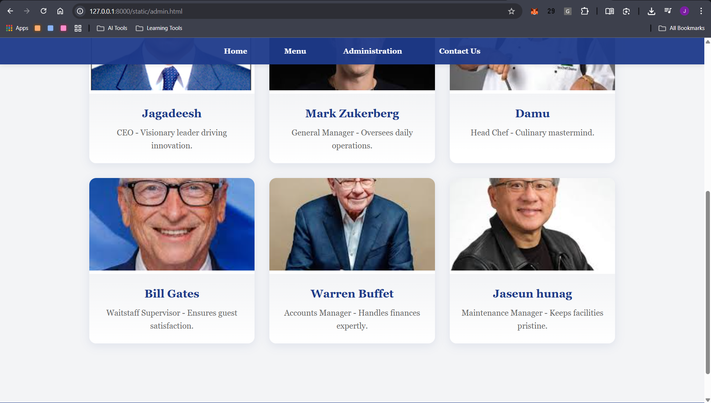
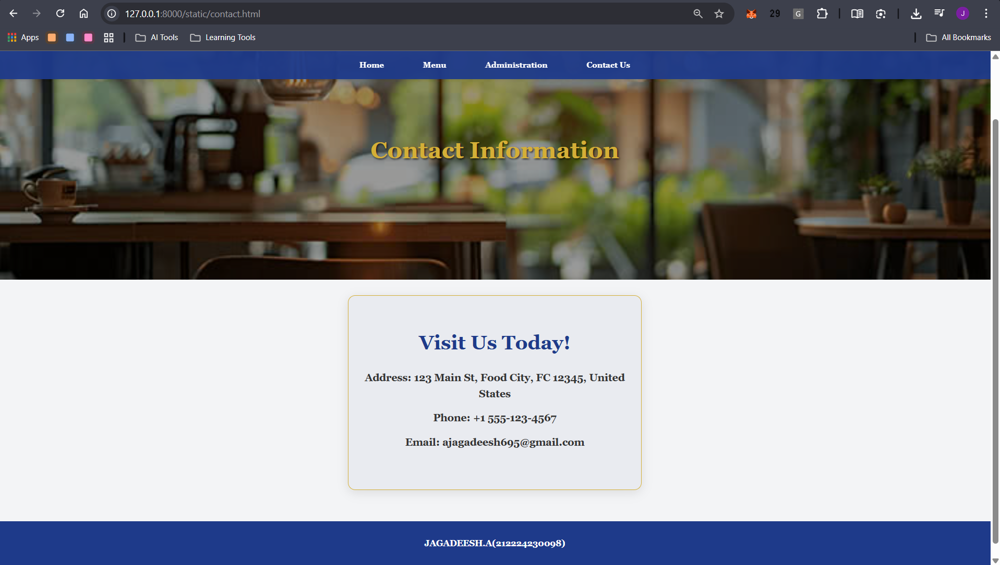

# Ex.07 Restaurant Website
## Date: 30-10-2025

## AIM:
To develop a static Restaurant website to display the food items and services provided by them.

## DESIGN STEPS:

### Step 1:
Requirement collection.

### Step 2:
Creating the layout using HTML and CSS.

### Step 3:
Updating the sample content.

### Step 4:
Choose the appropriate style and color scheme.

### Step 5:
Validate the layout in various browsers.

### Step 6:
Validate the HTML code.

### Step 7:
Publish the website in the given URL.

## PROGRAM:
# index.html
```
<!DOCTYPE html>
<html lang="en">
<head>
    <meta charset="UTF-8">
    <meta name="viewport" content="width=device-width, initial-scale=1.0">
    <title>Home - Wings Restaurant</title>
    <link rel="stylesheet" href="styles.css">
</head>
<body>
    <nav>
        <ul>
            <li><a href="index.html">Home</a></li>
            <li><a href="menu.html">Menu</a></li>
            <li><a href="admin.html">Administration</a></li>
            <li><a href="contact.html">Contact Us</a></li>
        </ul>
    </nav>

    <section class="home-hero">
        <div class="hero-content">
            <h1>Wings Restaurant</h1>
            <p>"Wings the Flavor, One Bite at a Time"</p>
        </div>
    </section>

    <section class="offer">
        <h2>Limited Time Special</h2>
        <h3>Buy One Entree, Get One 50% Off!</h3>
    </section>

    <footer>
        <p>JAGADEESH.A(212224230098)</p>
    </footer>
</body>
</html>
```
# menu.html
```
<!DOCTYPE html>
<html lang="en">
<head>
    <meta charset="UTF-8">
    <meta name="viewport" content="width=device-width, initial-scale=1.0">
    <title>Menu - Wings Restaurant</title>
    <link rel="stylesheet" href="styles.css">
</head>
<body>
    <nav>
        <ul>
            <li><a href="index.html">Home</a></li>
            <li><a href="menu.html">Menu</a></li>
            <li><a href="admin.html">Administration</a></li>
            <li><a href="contact.html">Contact Us</a></li>
        </ul>
    </nav>

    <section class="content-hero" style="background-image: url('banner.jpg');">
        <h1>Our Menu</h1>
    </section>

    <section class="grid-container">
        <div class="item-card">
            
            <div class="card-body">
                <h3>Classic Burger</h3>
                <p>$12 - Juicy beef patty with fresh toppings.</p>
            </div>
        </div>
        <div class="item-card">
            
            <div class="card-body">
                <h3>Carbonara Pasta</h3>
                <p>$15 - Creamy sauce with pancetta and cheese.</p>
            </div>
        </div>
        <div class="item-card">
            
            <div class="card-body">
                <h3>Caesar Salad</h3>
                <p>$8 - Crisp romaine with dressing and croutons.</p>
            </div>
        </div>
        <div class="item-card">
            
            <div class="card-body">
                <h3>Grilled chicken</h3>
                <p>$25 - Tender ribeye with herb butter.</p>
            </div>
        </div>
        <div class="item-card">
            
            <div class="card-body">
                <h3>Margherita Pizza</h3>
                <p>$14 - Fresh mozzarella and basil on crust.</p>
            </div>
        </div>
        <div class="item-card">
            
            <div class="card-body">
                <h3>California Roll</h3>
                <p>$18 - Crab, avocado, and cucumber roll.</p>
            </div>
        </div>
        <div class="item-card">
            
            <div class="card-body">
                <h3>Chocolate Lava Cake</h3>
                <p>$9 - Warm cake with molten center.</p>
            </div>
        </div>
        <div class="item-card">
            
            <div class="card-body">
                <h3>Tomato Basil Soup</h3>
                <p>$6 - Hearty and fresh tomato blend.</p>
            </div>
        </div>
        <div class="item-card">
            
            <div class="card-body">
                <h3>Turkey Club Sandwich</h3>
                <p>$10 - Layered turkey, bacon, and veggies.</p>
            </div>
        </div>
        <div class="item-card">
            
            <div class="card-body">
                <h3>Beef Taco</h3>
                <p>$11 - Seasoned beef in soft tortilla.</p>
            </div>
        </div>
        <div class="item-card">
            
            <div class="card-body">
                <h3>Vanilla Sundae</h3>
                <p>$7 - Ice cream with toppings and sauce.</p>
            </div>
        </div>
        <div class="item-card">
            
            <div class="card-body">
                <h3>Grilled Salmon</h3>
                <p>$22 - Lemon-herb seasoned fillet.</p>
            </div>
        </div>
    </section>

    <footer>
        <p>JAGADEESH.A(212224230098)</p>
    </footer>
</body>
</html>
```
# admin.html
```
<!DOCTYPE html>
<html lang="en">
<head>
    <meta charset="UTF-8">
    <meta name="viewport" content="width=device-width, initial-scale=1.0">
    <title>Administration - Wings Restaurant</title>
    <link rel="stylesheet" href="styles.css">
</head>
<body>
    <nav>
        <ul>
            <li><a href="index.html">Home</a></li>
            <li><a href="menu.html">Menu</a></li>
            <li><a href="admin.html">Administration</a></li>
            <li><a href="contact.html">Contact Us</a></li>
        </ul>
    </nav>

    <section class="content-hero" style="background-image: url('banner.jpg');">
        <h1>Our Team</h1>
    </section>

    <section class="grid-container">
        <div class="item-card">
            
            <div class="card-body">
                <h3>Jagadeesh</h3>
                <p>CEO - Visionary leader driving innovation.</p>
            </div>
        </div>
        <div class="item-card">
            
            <div class="card-body">
                <h3>Mark Zukerberg</h3>
                <p>General Manager - Oversees daily operations.</p>
            </div>
        </div>
        <div class="item-card">
            
            <div class="card-body">
                <h3>Damu</h3>
                <p>Head Chef - Culinary mastermind.</p>
            </div>
        </div>
        <div class="item-card">
            
            <div class="card-body">
                <h3>Bill Gates</h3>
                <p>Waitstaff Supervisor - Ensures guest satisfaction.</p>
            </div>
        </div>
        <div class="item-card">
            
            <div class="card-body">
                <h3>Warren Buffet</h3>
                <p>Accounts Manager - Handles finances expertly.</p>
            </div>
        </div>
        <div class="item-card">
            
            <div class="card-body">
                <h3>Jaseun hunag</h3>
                <p>Maintenance Manager - Keeps facilities pristine.</p>
            </div>
        </div>
    </section>

    <footer>
        <p>JAGADEESH.A(212224230098)</p>
    </footer>
</body>
</html>
```
# contact.html
```
<!DOCTYPE html>
<html lang="en">
<head>
    <meta charset="UTF-8">
    <meta name="viewport" content="width=device-width, initial-scale=1.0">
    <title>Contact Us - Wings Restaurant</title>
    <link rel="stylesheet" href="styles.css">
</head>
<body>
    <nav>
        <ul>
            <li><a href="index.html">Home</a></li>
            <li><a href="menu.html">Menu</a></li>
            <li><a href="admin.html">Administration</a></li>
            <li><a href="contact.html">Contact Us</a></li>
        </ul>
    </nav>

    <section class="content-hero" style="background-image: url('contact_bg.jpg');">
        <h1>Contact Information</h1>
    </section>

    <section class="contact-box">
        <h1>Visit Us Today!</h1>
        <h4>Address: 123 Main St, Food City, FC 12345, United States</h4>
        <h2>Phone: +1 555-123-4567</h2>
        <h3>Email: ajagadeesh695@gmail.com</h3>
    </section>

    <footer>
        <p>JAGADEESH.A(212224230098)</p>
    </footer>
</body>
</html>
```


## OUTPUT:
.png>)
.png>)
.png>)
.png>)
.png>)


## RESULT:
The program for designing software company website using HTML and CSS is completed successfully.
